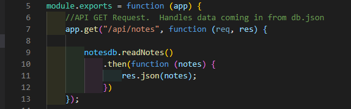

# Note_Taker
  
  ## Description 
  Application used to write, save, and delete notes using an express backend to save and retrieve note data from a JSON file.
  ## Table of Contents:
  - [Installation](#Installation)
  - [Usage](#Usage)
  - [License](#License)
  - [Breakdown](#Breakdown)
  - [Tests](#Tests)
  - [Questions](#Questions)
  ## Installation
  Have node installed, and run an "npm i" to install all requirements. Project requires Express and uuid.  Deployed on Heroku.
  ## Usage
  User types in a title for the notes, and the content of the notes, then presses save.  This will store that note to the sidebar on the left, where the user can click on it to revisit it, or they can choose to delete it.
  ## License
  MIT
  ## Breakdown
  
  - Sets up server with express, and requires routes which will handle the functionality between the front and back end.
  
  
  
  - Seperate file created to handle the read and write functions using fs.  Requires fs and util up top.  A class of notes is then created to export functionality to the rest of the project as an object.  The readNotes and writeNotes methods both use async await to make them synchronous.  The readNotes method takes the note data which is being sent to the db.json file, and parsing it so it so that it can be transferred between the front and back ends. The writeNotes method then stringifies and writes out those notes for the user. re-reads the new stringified note and returns it.  The class is the exported so that the methods can be called within the apiroute JS file.
  
  
  
  - Requires notesdb file shown above to be able to call the read and write methods, as well as uuid which will generate unique ids for each note.
  
  
  
  - Calls the readNotes method, using the notes parameter from the index.js file given for the front end, which is responsible for collecting the user input.
  
  
  
  - Calls the readNotes method to read the note so that it can then give it a unique id using uuid, then write it into the array of notes.
  
  
  
  - Calls the readNote method once more, so that it can read the file and filter it to single out the id, so that the note can then be deleted by the parameter of id.  It then rewrites the data, which will result in the deletion of the note.
  
  
  
  - Routes the pages, directing the users to the notes page when the link contains "/notes", and to the home page when the link only contains "/"
  
  
  
  ## Tests
  
  ## Questions
  For any questions, [mailto:alexisayyid@gmail.com], or visit my [GitHub] (https://github.com/aisayyid) 
  
  ### Deployed:
  
  https://vert-bastille-18136.herokuapp.com/
 
